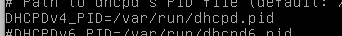
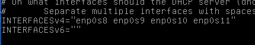
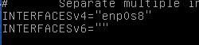
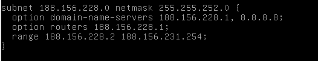
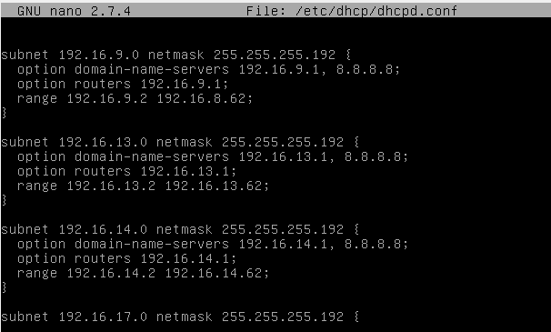
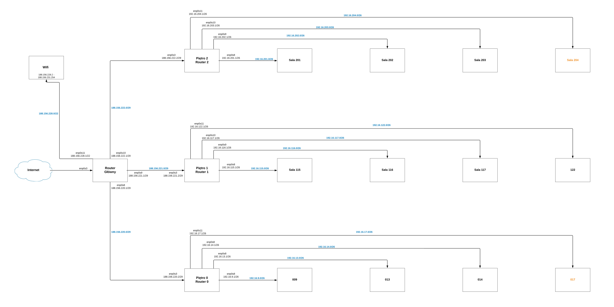

## 1. Maski podsieci
``Maska dla sieci na kazdym piętrze  - 255.255.255.248 (/29) - pomieści 6 hostów``

``Maska dla każdego z laboratorium - 255.255.255.192 (/26) - pomieści 62 hosty, potrzebujemy 35``

``Maska dla wifi - 255.255.252.0 (/22) - pomieści 1 022 hosty, potrzeba ok 800``

## 2. Ustalenie sieci
  ### Router Główny

  Piętro 0 - 188.156.220.0/29
  
  Piętro 1 - 188.156.221.0/29
  
  Piętro 2 - 188.156.222.0/29
  
  Wifi - 188.156.228.0/22
  
  ### Router 1
  Sala 009 - 192.16.9.0/26
  
  Sala 013 - 192.16.9.0/26
  
  Sala 014 - 192.16.9.0/26
  
  Sala 017 - 192.16.9.0/26
  
  ### Router 2
  Sala 115 - 192.16.115.0/26
  
  Sala 116 - 192.16.116.0/26
  
  Sala 117 - 192.16.117.0/26
  
  Sala 122 - 192.16.122.0/26
  
  ### Router 3
  Sala 201 - 192.16.201.0/26
  
  Sala 202 - 192.16.202.0/26
  
  Sala 203 - 192.16.203.0/26
  
  Sala 204 - 192.16.204.0/26
  
  ## 3. Adresy IP
  
  ### Router Głowny
  | Karta | Adres | Maska | Hosty|
  | --------- |:-------------| :---------------|:-------|
  | ``enp0s3`` |``Internet``|
  | ``enp0s8`` | ``188.156.220.1`` | ``/29``|````|
  | ``enp0s9`` | ``188.156.221.1`` | ``/29`` |````|
  | ``enp0s10`` | ``188.156.222.1`` | ``/29`` |````|
  | ``enp0s11`` | ``188.156.228.1`` | ``/22`` |``188.156.228.2-188.156.231.254 (1 021)``|
  ### Router 0
  | Karta | Adres | Maska | Hosty|
  | --------- |:-------------| :---------------|:-------|
  | ``enp0s3`` |``188.156.220.2``|``/29``||
  | ``enp0s8`` | ``192.16.9.1`` | ``/26``|``192.16.9.1 - 192.16.9.62``|
  | ``enp0s9`` | ``192.16.13.1`` | ``/26`` |``192.16.13.1 - 192.16.13.62``|
  | ``enp0s10`` | ``192.16.14.1`` | ``/29`` |``192.16.14.1 - 192.16.14.62``|
  | ``enp0s11`` | ``192.16.17.1`` | ``/26`` |``192.16.17.1 - 192.16.17.62`` |
  ### Router 1
  | Karta | Adres | Maska | Hosty|
  | --------- |:-------------| :---------------|:-------|
  | ``enp0s3`` |``188.156.221.2``|``/29``||
  | ``enp0s8`` | ``192.16.115.1`` | ``/26``|``192.16.115.1 - 192.16.115.62``|
  | ``enp0s9`` | ``192.16.116.1`` | ``/26`` |``192.16.116.1 - 192.16.116.62``|
  | ``enp0s10`` | ``192.16.117.1`` | ``/29`` |``192.16.117.1 - 192.16.117.62``|
  | ``enp0s11`` | ``192.16.122.1`` | ``/26`` |``192.16.122.1 - 192.16.122.62`` |
  ### Router 2
  | Karta | Adres | Maska | Hosty|
  | --------- |:-------------| :---------------|:-------|
  | ``enp0s3`` |``188.156.222.2``|``/29``||
  | ``enp0s8`` | ``192.16.201.1`` | ``/26``|``192.16.201.1 - 192.16.201.62``|
  | ``enp0s9`` | ``192.16.202.1`` | ``/26`` |``192.16.202.1 - 192.16.202.62``|
  | ``enp0s10`` | ``192.16.203.1`` | ``/29`` |``192.16.203.1 - 192.16.203.62``|
  | ``enp0s11`` | ``192.16.204.1`` | ``/26`` |``192.16.204.1 - 192.16.204.62`` |
  
  ###### W każdej sieci router został umieszczony na pierwszym dostępnym hoscie, np. dla sieci 192.16.201.0/26, broadcast wynosi 192.16.201.63/26, adres routera to 192.16.201.1/26, a komputerom pozostaje 61 miejsca (192.16.201.2/26 - 192.16.201.62/26 włącznie)
  
  ## 4. Port forwarding
  ##### Dla każdego z routerów włączamy przekierowywanie pakietów:
  ``echo 1 > /proc/sys/net/ipv4/ip_forward``
  ##### Będziemy chcieli mieć to na stałe, a więc:
  ``Tak samo jak w zadaniu 8 wchodzimy w nano /etc/sysctl.d/99-sysctl.conf i usuwamy znak komentarza przy net.ipv4.ip_forward=1``

  
  ## 5.DHCP
  #### Instalujemy dhcp (użyłem już udostępnionego na moodlu pcta) i wchodzimy do /etc/default/isc-dhcp-server, gdzie usuwamy znak komentarza przy configu DHCPv4
  
  #### Następnia dla Routerów 0, 1, 2 ustawiamy INTERFACESv4:
  
  #### W przypadku Routera Głównego ustawiamy tylko enp0s11, ponieważ to na tej sieci będą przydzielane adresy z dhcp do wifi:
  
  
  #### Następnie wchodzimy do /etc/dhcp/dhcpd.conf i dopisujemy konfiguracje sieci:
  #### Router główny:
  
  
  ``Po konfiguracji dhcp restartujemy go używając komendy systemctl restart isc-dhcp-server, po czym możemy sprawdzić sobie jego status - systemctl status isc-dhcp-server``
  
  #### Routery 0, 1, 2:
  
  #### I analogicznie do tego trzeba skonfigurować każdy router
  
    
  
  ## 6.Ustawienie routingu
  #### Tak jak w zadaniu 8 wpisujemy do /etc/network/interfaces routingi dla każdego routera:
  #### Router 0:
      up ip route add default via 188.156.220.1 
      up ip route add default via 192.16.9.1
      up ip route add default via 192.16.13.1
      up ip route add default via 192.16.14.1
      up ip route add default via 192.16.15.1
  #### Router 1 oraz 2 analogicznie do 0
      up ip route add default via 188.156.221.1
      up ip route add default via 192.16.115.1 etc..
  #### Router Główny
      up ip route add default via 188.156.228.1
  
  ## 7. Włączenie reguły MASQUERADE
  ### Router Głowny:
    iptables -t nat -A POSTROUTING -s 188.156.220.0/29 -o enp0s3 -j MASQUERADE
    
    iptables -t nat -A POSTROUTING -s 188.156.221.0/29 -o enp0s3 -j MASQUERADE
    
    iptables -t nat -A POSTROUTING -s 188.156.222.0/29 -o enp0s3 -j MASQUERADE
    
    iptables -t nat -A POSTROUTING -s 188.156.228.0/22 -o enp0s3 -j MASQUERADE
    
  #### Żeby zapisać reguły używamy komendy ipatables-save > /etc/iptables.up.rules po czym w pliku /etc/network/interfaces dodajemy wpis post-up iptables-restore < /etc/iptables.up.rules
  ## 8.Diagram
  
