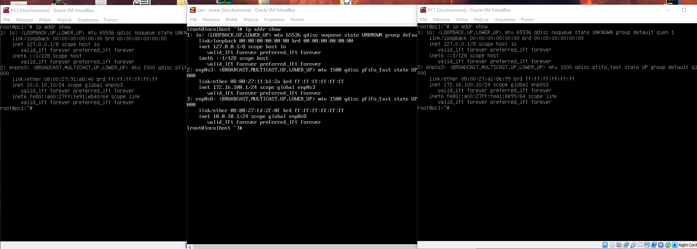
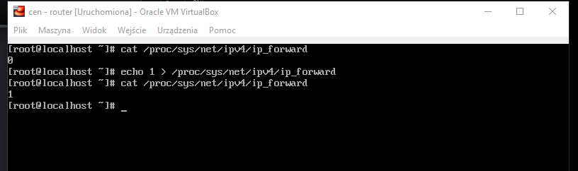
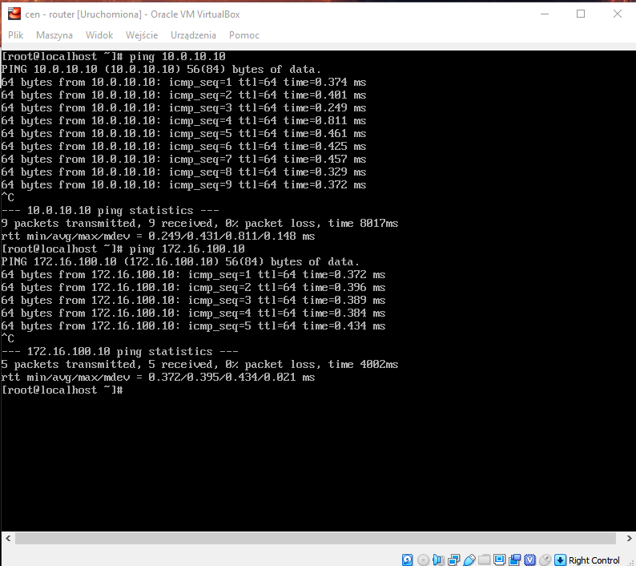
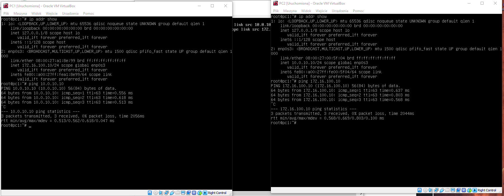

Konfiguracja route
------------------

* routing
    * dodaj trasę default
    * dodaj trasę przez bramę
    * dodaj trasę przez interfejs
    * usuń trasę
    * zmień trasę
    * pobierz trasę dla adresu
     
ip 
-------------------------
| subcommand    |  polecenie   | opis  |
| ------------- |:-------------| :---------------| 
|   ``route``   |                                | |
|               |   ``ip route show``            | pokaż tablice routingu |
|               |   ``ip route add default via``     | dodanie wpisu trasy deafult|
|               |   ``ip route get``             | pobranie trasy gdzie adres zostanie wyslany  |
|               |   ``ip route add``             | dodanie do tablicy|
|               |   ``ip route del``             | usunięcie z tablicy wpisu|

``przydatne:``
https://tlk.io/sk-2019 <- obraz pc

root:123qwe

ip addr add 172.16.100.10/24 dev enp0s3

ip addr add 10.0.10.10/24 dev enp0s3

2 sieci lan, sieci nat, pc0 podlaczony do obu

ip link set enp0s8 up

ip route default via 10.0.10.1/172.16.100.1 <- do routera

cat /proc/sys/net/ipv4/ip_forward

cat /etc/sysctl.conf

echo 1 > /proc/sys/net/ipv4/ip_forward``

Zadanie
------------

1.
   * Przygotuj konfigurację sieci zgodnie z powyższym diagramem, 
   * Przetestuj połączenie pomiędzy wszystkimi elementami sieci
   * Dlaczego połączenie może nie działać
2. Przygotuj konfigurację tak aby została załadowana poprawnie po ponownym uruchomieniu systemu
   * Patrz ``utrwalanie statycznej konfiguracji cwiczenia 2``
   * zwróć uwagę na różnice pomiędzy dydtrybucjami systemu
3. Zainstaluj, uruchom i przetestuj działanie aplikacji ``HTTP_CHAT``
   * aplikacja dostępna w serwisie github ``https://github.com/jkanclerz/http-chat``

Zadanie do domu
---------------

1. Przygotuj konfigurację z zadania 1 wykorzystując inny system operacyjny na komputerze pełniącym rolę routera.
  * debian -> centos lub centos -> debian
  * zapewnij poprawną komunikację pomiędzy PC3 -> PC1
  
  Konfiguracja obu systemów, router będzie znajdował się na centosie.
  * Utworzenie 2 sieci nat, odpowiednio ``lan1  - 172.168.10.0/24`` oraz ``lan2 - 10.0.10.0/24``
  * Przydzielenie do PC1 i PC2 sieci NAT
  * ``ip addr add 172.16.100.10/24 dev enp0s3`` <- PC1
  * ``ip addr add 10.0.10.10/24 dev enp0s3`` <- PC2
  * podłączenie lan1 i lan2 do routera
  * ``ip link set enp0s8 up`` <- podniesienie interfejsu enp0s8 na routerze
  * ``ip addr add 172.16.100.1/24 dev enp0s3`` oraz ``ip addr add 10.0.10.1/24 dev enp0s8`` <- router
  
  * ``cat /proc/sys/net/ipv4/ip_forward`` oraz ``echo 1 > /proc/sys/net/ipv4/ip_forward`` <- włączenie port forwaringu w kernelu
  
  * ``ping 172.16.100.10`` oraz ``ping 10.0.10.10`` z routera
  
  * ``ip route add default via 172.16.100.1`` oraz ``ip route add default via 10.0.10.1`` oraz wzajemne pingowanie się PC1 oraz PC2
  
  * pobranie na routerze httl-chat - > ``yum install git -> git clone https://github.com/jkanclerz/http-chat -> cd html-chat -> cd server -> python httpchat.py``
  Z jakiegoś powodu httpchat nie chciał współpracować, prawdopodobnie błedy w ustawieniach centosa
  
  
  
