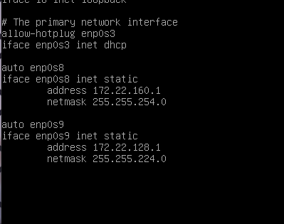
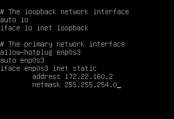
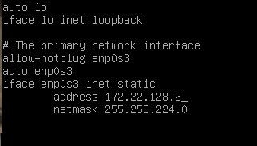
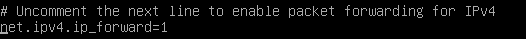
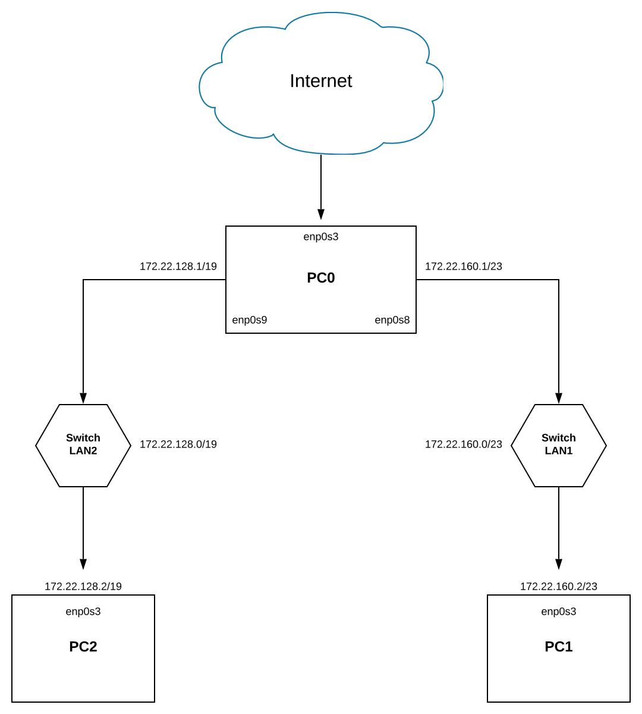

Zadanie 1 Rozwiązanie
---------

## 1. Ustalenie netmaski oraz adresów sieci:
  * dla 5000 urządzeń  - ``/19``  - 255.255.224.0
  * dla 500 urządzeń - ``/23`` - 255.255.254.0
  
  Sieć zaczniemy dzielić od LAN2, ponieważ jest w niej większa ilość hostów.
  
  --------------------------------------------------------
  | Sieć | Adres sieci    | Zakres hostów | Adres rozgłoszeniowy |
  | ----- |:------------- |:-------------| :-------------|
  | ``LAN2`` |   ``172.22.128.0/19``    | ``172.22.128.1 - 172.22.159.254 (8 190 hostów)`` | ``172.22.159.255`` |
  | ``LAN1`` |   ``172.22.160.0/23``    | ``172.22.160.1 - 172.22.161.254 (510 hostów)`` | ``172.22.161.255`` |

## 2. Konfiguracja PCtów
### A. Dodanie adresów IP
``Można użyć polecenia ip addr add 172.22.128.1/23 dev enp0s8, lecz dzięki nano /etc/network/interfaces po restarcie pcta konfiguracja pozostanie (ewentualnie ifup -a)``
#### PC0

#### PC1

#### PC2

### B. Dodanie reguły MASQUERADE i włączenie przekierowywania pakietów dla PC0
#### Przekierowanie pakietów
``echo 1 > /proc/sys/net/ipv4/ip_forward``

``Jeśli chcemy żeby po resecie maszyny ip_forward został wchodzimy w nano /etc/sysctl.conf i kasujemy znak komentarza przy net.ipv4.ip_forward=1``

#### Dodanie reguły MASQUERADE dla LAN1
``iptables -t nat -A POSTROUTING -s 172.22.160.0/23 -o enp0s3 -j MASQUERADE``
#### Dodanie reguły MASQUERADE dla LAN2
``iptables -t nat -A POSTROUTING -s 172.22.128.0/19 -o enp0s3 -j MASQUERADE``

Da się to także zapisać aby po resecie zostało, https://wiki.debian.org/iptables

### C. Ustawienie routingu
Znowu w pliku ``nano /etc/network/interfaces``
#### PC1
``up ip route add default via 172.22.160.1``
#### PC2
``up ip route add default via 172.22.128.1``

### D. Włączenie DNS PC1 i PC2
``wchodzimy w nano /etc/resolv.conf``

``nameserver 8.8.8.8``
## 3. Diagram

